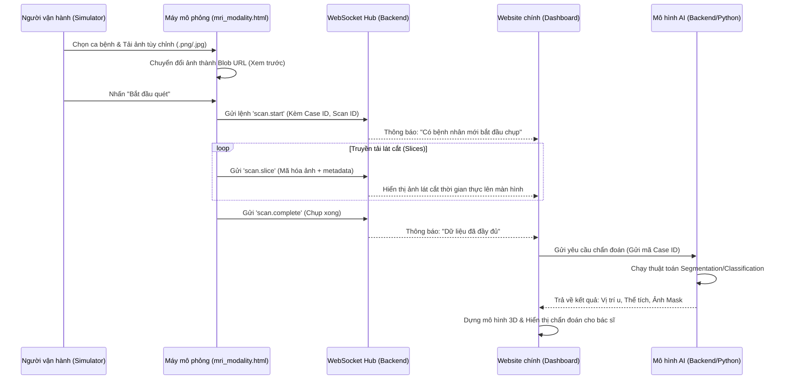

# Quy trình Mô phỏng MRI & Chẩn đoán AI Thời gian thực

Tài liệu này giải thích chi tiết cách thức hoạt động của hệ thống từ lúc người dùng tải ảnh lên bộ mô phỏng MRI cho đến khi kết quả chẩn đoán xuất hiện trên Website chính.

## 1. Sơ đồ Luồng dữ liệu (Data Flow)

---

## 2. Chi tiết 6 bước thực hiện

### Bước 1: Chọn ảnh và Thiết lập (tại Simulator)
- **Hành động**: Bạn nhấn vào nút 📸 trên danh sách chờ. Một Modal hiện ra cho phép bạn chọn các file ảnh MRI từ máy tính.
- **Xử lý**: Trình duyệt tạo ra các **Object URL** (link tạm thời) để hiển thị thumbnail ngay lập tức mà chưa cần gửi lên server. Việc chọn nhiều ảnh giúp mô phỏng một "chuỗi xung" (Series) hoàn chỉnh.

### Bước 2: Khởi tạo phiên làm việc (Scan Session)
- **Hành động**: Nhấn "Bắt đầu quét".
- **Kỹ thuật**: Hệ thống tạo ra một **Scan ID** duy nhất. 
- **Gửi tin**: Simulator gửi gói tin `scan.start` qua WebSocket. Website chính nhận được sẽ tự động chuyển sang chế độ "Live Acquisition" (Thu nhận trực tiếp), hiển thị tên bệnh nhân và thông số máy quét.

### Bước 3: Truyền tải lát cắt thời gian thực (Streaming)
- **Hành động**: Máy ảo bắt đầu gửi từng ảnh một theo khoảng cách thời gian (ví dụ 500ms một ảnh).
- **Dữ liệu**: Mỗi gói tin `scan.slice` chứa:
    - ID của bệnh nhân.
    - Số thứ tự lát cắt (Ví dụ: Lát thứ 5/12).
    - Đường dẫn ảnh hoặc dữ liệu Base64 của ảnh.
- **Website chính**: Cập nhật thanh tiến trình (Progress bar) và hiển thị ảnh lát cắt vừa nhận được để bác sĩ thấy "máy đang chụp tới đâu".

### Bước 4: Kết thúc thu nhận dữ liệu
- **Hành động**: Sau khi gửi hết ảnh, Simulator gửi lệnh `scan.complete`.
- **Website chính**: Đóng luồng nhận dữ liệu, hiển thị thông báo "Thu nhận hoàn tất, đang chờ AI xử lý".

### Bước 5: Phân tích AI (Phía Backend)
- **Cơ chế**: Website chính gửi một yêu cầu HTTP POST tới Backend.
- **Xử lý**: 
    - Backend lấy danh sách ảnh mà Simulator vừa gửi (hoặc ảnh trong database của Case đó).
    - Đưa vào mạng Nơ-ron (CNN/U-Net) để tìm khối u.
    - Tính toán tọa độ X, Y, Z và mức độ ác tính.

### Bước 6: Trả kết quả và Hiển thị (tại Website chính)
- **Kết quả**: Backend trả về một JSON chứa toàn bộ dữ liệu chẩn đoán.
- **Hiển thị**: 
    - **2D**: Đánh dấu vùng nghi ngờ trên lát cắt.
    - **3D**: Dựng khối u màu đỏ/vàng bên trong mô hình não 3D.
    - **Thông tin**: Hiển thị bảng báo cáo chi tiết về kích thước khối u và các rủi ro liên quan.

---

## 3. Tại sao hệ thống biết trả về đúng ảnh của ca đó?

Bí quyết nằm ở **Sự đồng bộ hóa ID**:
1.  **Case ID**: Cố định (Ví dụ: `PT-2401`).
2.  **Trạng thái Dashboard**: Website chính luôn lưu giữ trạng thái "Đang xem ca nào". Khi nhận dữ liệu từ Simulator có ID trùng với ca đang xem, nó sẽ tự động cập nhật vào màn hình đó.
3.  **Tên File**: Các ảnh bạn tải lên được Simulator gắn tên file rõ ràng, Backend sẽ dựa vào tên file này để đối chiếu kết quả khi trả về.

---

